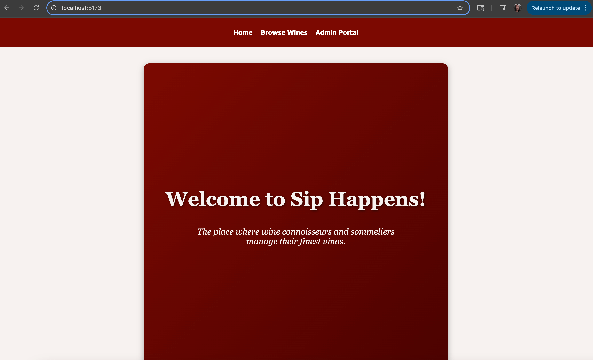
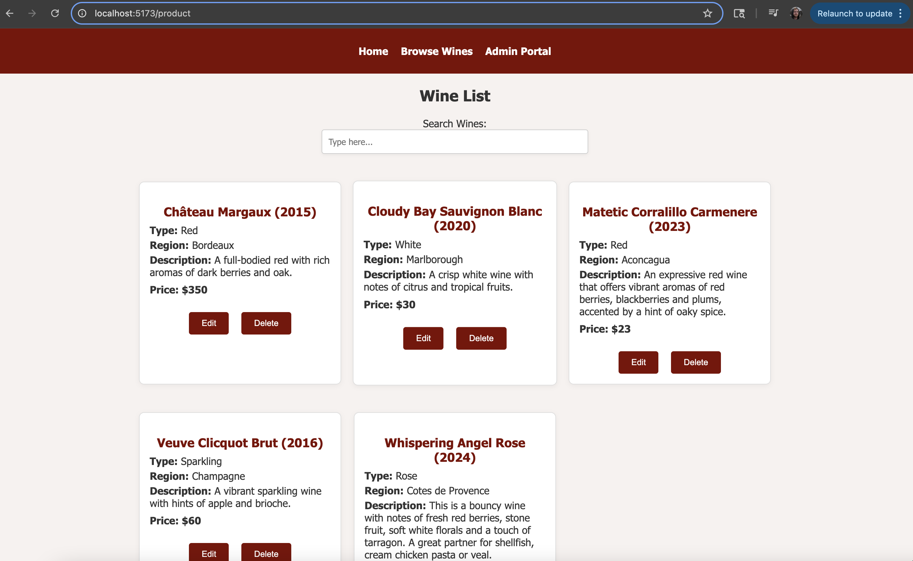
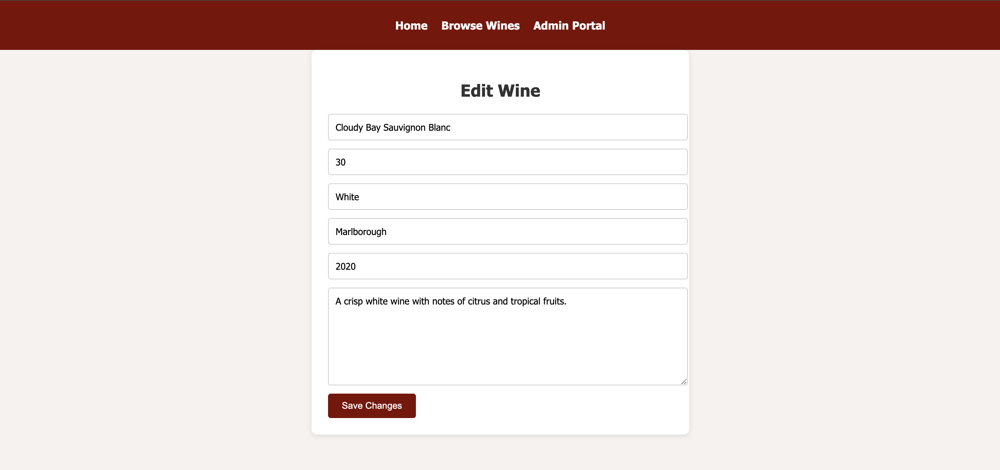
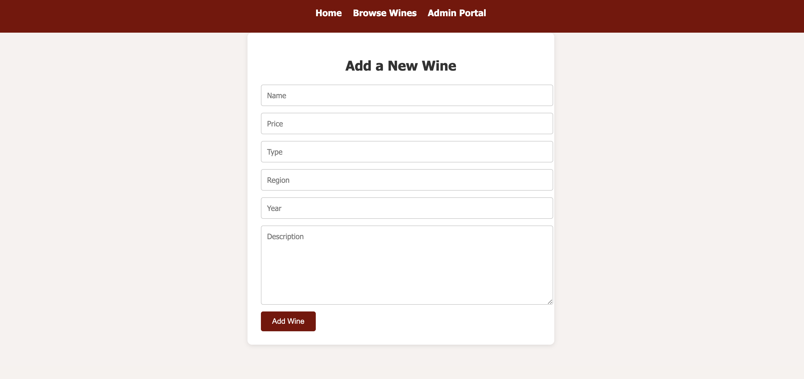

# Sip Happens!

This is a React-based wine catalog web application that allows administrators to:
- Browse a list of wines
- Search and filter wines
- Add, edit and delete wine product entries

## Features:
- Client-side routing with React Router
- Live search by name, type, region, or year of wine
- Admin form to add/edit/delete wines
- Custom hooks and context for product management
- Unit and integration tests with Vitest and React Testing Library

## Setup Instructions:
1. After cloning the repository from GitHub, be sure to install dependencies via:
    npm install
2. Start the mock server via:
    npm install -g json-server
    json-server --watch db.json --port 6001
3. Run the development server via:
    npm run dev
4. Open you browser and enter http://localhost:5173

## Running Tests:
This project uses Vitest and React Testing Library.
Run test via:
    npm run test

## Screenshots:

-----------------

Thank you and enjoy!
